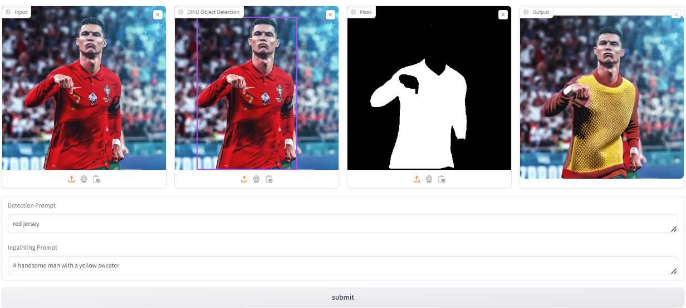

# Multi-Modal Image Generation using Grounding DINO Segment Anything Model and Stable Diffusion

## Overview
This project integrates multiple functionalities for image processing, including zero-shot object detection using Grounding DINO, followed by semantic segmentation with Meta AI's Segment Anything Model (SAM) and Finally Inpainting using Stability AI's Stable Diffusionv2 for inpainting the input image. The inpainting quality assessment was done using Peak Signal-to-Noise Ratio (PSNR) and Structural Similarity Index (SSIM).
The gaol of the project was to integrate these techniques and deploy the model on Hugging Face with a Gradio interface for users to detect, segment regions and inpaint them in the provided images.  

## Dependencies

- gradio
- numpy
- torch
- diffusers
- PIL
- cv2
- skimage
- huggingface_hub
- GroundingDINO
- torchvision
- 
## Key Features

- **Object Detection:** Utilizes DINO for object detection within images.
- **Object Segmentation:** Utilizes SAM for object detection within the bounding box.
- **Image Inpainting:** Implements Stable Diffusion for inpainting missing regions in images.
- **Quality Assessment:** Computes PSNR and SSIM metrics to assess the quality of processed images.

## Usage

1. **Input Image:** Upload an image or drag and drop the Input Image in the first window for processing.
2. **Detection Prompt:** Enter a prompt in the first text box with the object/accessory you want to detect.
3. **Mask Generation:**  Click on the Region of Interest created by the detected box in the second window for mask generation using SAM.(It is recommended to click on multiple areas of the ROI to get a better and finer mask).
4. **Inpainting Prompt:** After you are satisfied with the mask, enter the prompt in the secnd text box for inpainting the region with the object.accesory of your choice.
5. **Submit:** Click to initiate processing and view the output. (Submitting the prompt multiple times will create different variations)

## Testing Results

### Gradio Demo

**NOTE:** This application works best for image swith the resolution of 512x512 for images with a higher resolution the inapinting quality drops substantially.

## References

- [DINO GitHub Repository](https://github.com/facebookresearch/dino)
- [Stable Diffusion Inpainting GitHub Repository](https://github.com/stabilityai/stable-diffusion-2-inpainting) 
